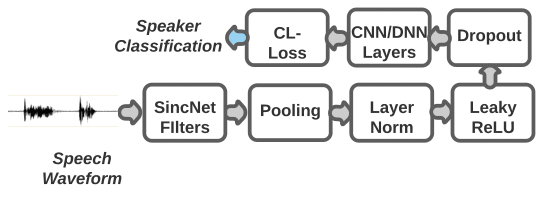

# Curricular SincNet: Towards Robust Deep Speaker Recognition by Emphasizing Hard Samples in Latent Space.
This repository is part of supplementary materials for our paper which is accepted in the **20th International Conference of the Biometrics Special Interest Group (BIOSIG 2021)**

Published version available [here](www.biosig.de)

Authors: Labib Chowdhury, Mustafa Kamal, Najia Hasan, Nabeel Mohammed

### Abstract
Deep learning models have become an increasingly preferred option for biometric recognition systems, such as speaker recognition. SincNet, a deep neural network architecture, gained popularity in speaker recognition tasks due to its parameterized sinc functions that allow it to work directly on the speech signal. The original SincNet architecture uses the softmax loss, which may not be the most suitable choice for recognition-based tasks. Such loss functions do not impose inter-class margins nor differentiate between easy and hard training samples. Curriculum learning, particularly those leveraging angular margin-based losses, has proven very successful in other biometric applications such as face recognition. The advantage of such a curriculum learning-based techniques is that it will impose inter-class margins as well as taking to account easy and hard samples.  In this paper, we propose Curricular SincNet(CL-SincNet), an improved SincNet model where we use a curricular loss function to train the SincNet architecture. The proposed model is evaluated on multiple datasets using intra-dataset and inter-dataset evaluation protocols. In both settings, the model performs competitively with other previously published work. In the case of inter-dataset testing, it achieves the best overall results with a reduction of  4\% error rate compare to SincNet and other published work.


### Proposed Architechture


## Cite us
If you use this code or part of it, please cite us!
### bibtex
```

```
## Prerequisites
- Linux
- Python 3.7
- pytorch 1.4
- conda environment (``` conda create -n clsincnet python=3.7 ```)
- requirement.txt (``` pip install -r requirements.txt ```)

## How to run a TIMIT experiment
Even though the code can be easily adapted to any speech dataset, in the following part of the documentation we provide an example based on the popular [TIMIT dataset.

**1. Run TIMIT data preparation.**

This step is necessary to store a version of TIMIT in which start and end silences are removed and the amplitude of each speech utterance is normalized. To do it, run the following code:

``
python TIMIT_preparation.py $TIMIT_FOLDER $OUTPUT_FOLDER data_lists/TIMIT_all.scp
``
**NOTE: This script expects filenames in lowercase (e.g, train/dr1/fcjf0/si1027.wav" rather than "TRAIN/DR1/FCJF0/SI1027.WAV)**

where:
- *$TIMIT_FOLDER* is the folder of the original TIMIT corpus
- *$OUTPUT_FOLDER* is the folder in which the normalized TIMIT will be stored
- *data_lists/TIMIT_all.scp* is the list of the TIMIT files used for training/test the speaker id system.

**2. Run the speaker id experiment.**

- Modify the *[data]* section of *cfg/SincNet_TIMIT.cfg* file according to your paths. In particular, modify the *data_folder* with the *$OUTPUT_FOLDER* specified during the TIMIT preparation. The other parameters of the config file belong to the following sections:
 1. *[windowing]*, that defines how each sentence is split into smaller chunks.
 2. *[cnn]*,  that specifies the characteristics of the CNN architecture.
 3. *[dnn]*,  that specifies the characteristics of the fully-connected DNN architecture following the CNN layers.
 4. *[class]*, that specify the softmax classification part.
 5. *[optimization]*, that reports the main hyperparameters used to train the architecture.

 6. **If you are wondering, the loss function is implemented in the metrics.py file**

- Once setup the cfg file, you can run the speaker id experiments using the following command:

``
python speaker_id.py --cfg=cfg/SincNet_TIMIT.cfg
``

The network might take several hours to converge (depending on the speed of your GPU card). In our case, using an *nvidia RTX2060 Super*, the full training took about 40 hours. 


**We would like to thank [@mravanelli](https://github.com/mravanelli/SincNet) for SincNet implementation and [@HuangYG123](https://github.com/HuangYG123) for his awesome CurricularFace paper**
